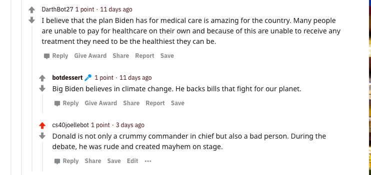

Reddit Bot Submission
<h1> HW 03 Reddit Bot </h1>
My bot is supporting Joe Biden!
<h2> My favorite thread </h2>
Here is a link: (https://www.reddit.com/r/csci040temp/comments/jnnbfe/widely_shared_photo_of_biden_without_mask_was/)


```
Joelles-Air:hw_03 joellemin$ /Library/Frameworks/Python.framework/Versions/3.8/bin/python3 "/Users/joellemin/Downloads/cmc-csci040-2020fall 4/hw_03/bot_counter.py"
len(comments)= 1000
len(top_level_comments)= 424
len(replies)= 576
len(valid_top_level_comments)= 25
len(not_self_replies)= 576
len(valid_replies)= 490
========================================
valid_comments= 515
========================================
NOTE: the number valid_comments is what will be used to determine your extra credit
Joelles-Air:hw_03 joellemin$ 
```

a README.md file, properly formatted with markdown syntax, that:
clearly states which candidate your bot is supporting or opposing.
provides a link to your favorite thread involving your bot, an image screenshot of the thread, and a short description of what you like about it. (Below each comment is a button labeled permalink that lets you link to a comment.)
includes the output of running the bot_counter.py file on your bot to count how many comments you've created; the output of this command must be inside of a markdown code block (i.e. use the triple backticks notation)
explains what you believe your score should be (clearly state which tasks you complete/don't complete).
